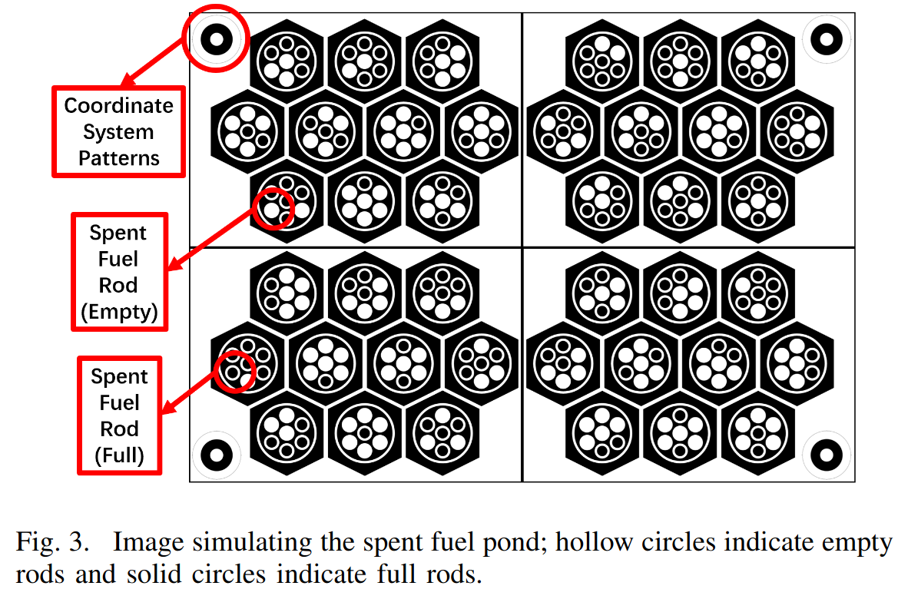
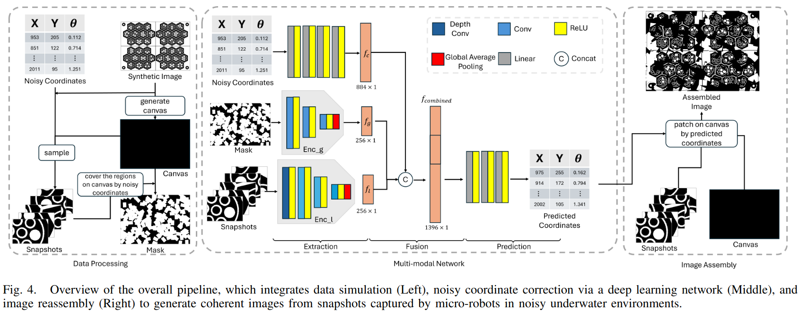

# Deep Learning-Enhanced Visual Monitoring in Hazardous Underwater Environments with a Swarm of Micro-Robots
============================

Long-term monitoring and exploration of extreme environments, such as underwater storage facilities, is costly, labor-intensive, and hazardous. Automating this process with low-cost, collaborative robots can greatly improve efficiency. These robots capture images from different positions, which must be processed simultaneously to create a spatio-temporal model of the facility. In this paper, we propose a novel approach that integrates data simulation, a multi-modal deep learning network for coordinate prediction, and image reassembly to address the challenges posed by environmental disturbances causing drift and rotation in the robots' positions and orientations. Our approach enhances the precision of alignment in noisy environments by integrating visual information from snapshots, global positional context from masks, and noisy coordinates. We validate our method through extensive experiments using synthetic data that simulate real-world robotic operations in underwater settings. The results demonstrate very high coordinate prediction accuracy and plausible image assembly, indicating the real-world applicability of our approach. The assembled images provide clear and coherent views of the underwater environment for effective monitoring and inspection, showcasing the potential for broader use in extreme settings, further contributing to improved safety, efficiency, and cost reduction in hazardous field monitoring.


**spent fuel pond**
--------------------




**Overview**
--------------------




**Getting Started**
---------
*Data Preparation*

Training Data:

Step 1:

in `generate_data.py`, change 
```
output_dir = './to_your_training_folder'
n = 10 (n for the number of images you wish to generate)
```
run
```
python generate_data.py
```

You should get a folder named 'to_your_training_folder' with n images.
---------
Step 2: 
in `data_process.py`, change 
```
input_images_dir = "./to_your_training_folder/"
data_dir = "./data/"
```

run 
```
python data_process.py
```

Then you should get a folder named 'data' with n folders named pool1, pool2 .... pooln

---------
Test Data:
You could use the similar way to get the test data, just change the folder name in `generate_data.py` and `data_process.py`.

**Training**
---------
in `train.py` change:
```
data_dir = './data/'
```
run 
```
python train.py
```


**Test**
---------
in `test.py` change:
```
test_data_dir = './your_test_data_folder/'
model.load_state_dict(torch.load('./coordinate_correction_checkpoint_epoch_xx.pth'))
```

run 
```
python test.py
```


